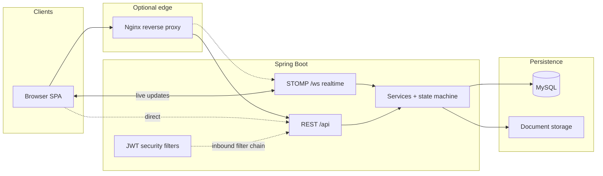
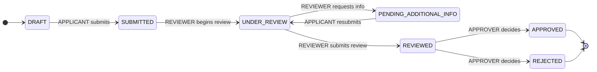

# Bank Licensing & Compliance Portal — Design Document

This document explains **architecture**, **data**, **workflow**, **roles**, and **trade-offs**. It is written for reviewers who need to see *why* things are structured as they are, not only *what* was built.

---

## 1. Architecture

### 1.1 System context

The product is an **internal-style** web portal: a **React** single-page application talks to a **Spring Boot** API over HTTPS (or plain HTTP in local dev). The API uses **MySQL** for authoritative state and a **local filesystem directory** for document blobs. **Flyway** owns the relational schema; **JWT** carries authentication; **RBAC** is enforced on every mutating path on the server. The browser also opens a **WebSocket** to the same host for **STOMP** messages so application lists and details can refresh in near real time (`/ws`, proxied like `/api` in production).

**Why this split:** regulators and applicants need a shared case file with a clear audit trail. A single API boundary keeps workflow rules, authentication, and evidence in one place; the SPA is a thin client that must never be the only line of defence.

### 1.2 Backend layering

| Layer | Responsibility | Why |
| ----- | ---------------- | --- |
| **Controllers** (`web/controller`) | HTTP mapping, DTOs, `@PreAuthorize` coarse gates | Keeps transport concerns out of domain logic; first line of “is this role even allowed to hit this endpoint?” |
| **Services** (`service`) | Workflows, ownership checks, calls to `ApplicationStateMachine`, audit writes | All non-trivial rules live here so they are testable without MockMvc for every case |
| **State machine** (`ApplicationStateMachine`) | Pure `(from, to, role)` matrix | Isolated POJO: easy to prove every *declared* transition in unit tests |
| **Repositories** | Persistence; `AuditLog` deliberately **not** a full `JpaRepository` | Append-only audit is a **legal** constraint, not a CRUD convenience |
| **Domain entities** (`domain`) | JPA mapping, `@Version` on `Application` | Optimistic locking belongs on the aggregate that concurrent users edit |
| **Security** | `JwtAuthenticationFilter`, `JwtService`, handlers for 401/403 | Consistent error envelope even outside `@RestControllerAdvice` for entry points |
| **Exception → API** | `GlobalExceptionHandler` + `ApiError` | No stack traces in JSON; stable status-code semantics |

**Communication pattern:** controllers resolve the **current user** from the JWT via `CurrentUserResolver` (loading the user by id from the DB), then delegate to services. Services never trust path or body fields for **actor identity**—only the authenticated principal.

### 1.3 Frontend role

The SPA (`frontend/`) uses **TanStack Query** for server state, **React Router** for navigation, and a small **capability matrix** (`actionsFor`) so users **do not see** actions they cannot perform. That is **UX**, not security: the backend repeats every check.

**Why structured this way:** clarity for operators (no disabled mystery buttons) and defence in depth (crafted HTTP requests still fail safely).

### 1.4 Key structural trade-offs

| Choice | Benefit | Cost |
| ------ | -------- | --- |
| **JWT stateless auth** | Horizontal scale without session stickiness or Redis | No instant server-side revocation (see §5.2) |
| **Optimistic locking** (`@Version`) | Read-heavy workflow; rare write conflicts fail fast with 409 | Losers must retry; not ideal if contention were high |
| **Filesystem document store** | Simple ops for a brownfield regulator stack | No built-in virus scan, replication, or WORM—must be layered in production |
| **Monolith** | One deployable, clear transaction boundaries | Later extraction (e.g. notifications service) needs explicit boundaries |

---

## 2. Data model

Schema is defined in Flyway migrations (`src/main/resources/db/migration/`). Hibernate validates entities against these tables (`spring.jpa.hibernate.ddl-auto=validate`).

### 2.1 `users`

| Column | Type | Notes |
| ------ | ---- | ----- |
| `id` | BIGINT PK | Surrogate key |
| `email` | VARCHAR(255) UNIQUE | Login identifier |
| `password_hash` | VARCHAR(255) | BCrypt (or configured encoder) |
| `full_name` | VARCHAR(255) | Display |
| `role` | VARCHAR(32) | One of `APPLICANT`, `REVIEWER`, `APPROVER`, `ADMIN` (CHECK) |
| `enabled` | BOOLEAN | Soft disable |
| `created_at` | TIMESTAMP(3) | UTC |

**Design choice:** one role per user keeps the model and JWT simple. **Trade-off:** real organisations sometimes need composite duties; we enforce **separation of reviewer vs approver** by **user id on the application**, not by issuing multiple roles on one account.

### 2.2 `applications`

| Column | Type | Notes |
| ------ | ---- | ----- |
| `id` | BIGINT PK | Case file id |
| `institution_name` | VARCHAR(255) | Applicant-facing label |
| `license_type` | VARCHAR(64) | Code aligned with `license_types.code` when created |
| `description` | TEXT NULL | Free text |
| `status` | VARCHAR(32) | Workflow enum (CHECK); see §3 |
| `applicant_id` | FK → users | Owner |
| `assigned_reviewer_id` | FK NULL | Admin assignment / workflow hint |
| `last_reviewer_id` | FK NULL | User who moved case to `REVIEWED` — used for **approver separation** |
| `final_decision_by_id` | FK NULL | Approver who terminalised the case |
| `review_recommendation` | VARCHAR(32) NULL | Reviewer recommendation enum |
| `decision_notes` | TEXT NULL | Approver narrative |
| `created_at`, `updated_at` | TIMESTAMP(3) | Audit-friendly |
| `version` | BIGINT NOT NULL DEFAULT 0 | JPA **optimistic lock** |

Indexes: by `applicant_id`, by `status` (work queues).

### 2.3 `documents`

| Column | Type | Notes |
| ------ | ---- | ----- |
| `id` | BIGINT PK | |
| `application_id` | FK | Parent case |
| `uploader_id` | FK | Must match applicant rules in service |
| `original_filename` | VARCHAR(255) | User-visible name |
| `stored_filename` | VARCHAR(255) UNIQUE | Opaque name on disk |
| `mime_type` | VARCHAR(127) | |
| `size_bytes` | BIGINT | CHECK `> 0` |
| `version_number` | INT | Increments on resubmit pathway |
| `uploaded_at` | TIMESTAMP(3) | |

**Design choice:** metadata in MySQL, bytes on disk. **Trade-off:** backup/restore must include the document root; DB alone is incomplete.

### 2.4 `audit_log` (append-only)

| Column | Type | Notes |
| ------ | ---- | ----- |
| `id` | BIGINT PK | Monotonic ordering tie-breaker |
| `occurred_at` | TIMESTAMP(3) | Evidence timestamp |
| `acting_user_id` | FK NOT NULL | Never from client |
| `application_id` | FK NULL | Null for non-case events (e.g. login) |
| `action` | VARCHAR(64) | Verb / enum string |
| `state_before`, `state_after` | VARCHAR(32) NULL | Real transition or duplicated current state for non-transition app events; NULL if no application |
| `notes` | TEXT NULL | Human narrative |

**Invariant:** application code must not UPDATE/DELETE rows. Repository design + tests (`AuditLogAppendOnlyTest`) enforce this in the JVM; production should **revoke UPDATE/DELETE** on this table for the runtime DB user (see §5.3).

### 2.5 `license_types` (catalog)

| Column | Type | Notes |
| ------ | ---- | ----- |
| `id` | BIGINT PK | |
| `code` | VARCHAR(64) UNIQUE | Stored on `applications.license_type` |
| `label` | VARCHAR(255) | UI dropdown |
| `enabled` | BOOLEAN | Disabled = not selectable for **new** drafts |
| `created_at` | TIMESTAMP(3) | |

### 2.6 Audit row semantics (`state_before` / `state_after`)

| Scenario | `state_before` / `state_after` |
| -------- | ------------------------------ |
| **Status transition** | Real **from** / **to** enums |
| **Application event without status change** (e.g. document upload, reviewer assignment) | Both set to **current** `ApplicationStatus` at event time |
| **User/platform event** (no case), e.g. login, registration | **NULL** / **NULL** |

`acting_user_id`, `action`, and `occurred_at` are always populated for every row.

---

## 3. State machine

### 3.1 States

`ApplicationStatus`:  
`DRAFT`, `SUBMITTED`, `UNDER_REVIEW`, `PENDING_ADDITIONAL_INFO`, `REVIEWED`, `APPROVED`, `REJECTED`.

**Terminal:** `APPROVED`, `REJECTED` — no legal workflow transition *out* of these statuses (see `ApplicationStatus.isTerminal()` and `ApplicationStateMachine`).

### 3.2 Diagram

### 3.3 Valid transitions (authoritative)

Encoded in `ApplicationStateMachine.TRANSITIONS`:

| From | To | Role |
| ---- | -- | ---- |
| `DRAFT` | `SUBMITTED` | `APPLICANT` |
| `PENDING_ADDITIONAL_INFO` | `UNDER_REVIEW` | `APPLICANT` |
| `SUBMITTED` | `UNDER_REVIEW` | `REVIEWER` |
| `UNDER_REVIEW` | `PENDING_ADDITIONAL_INFO` | `REVIEWER` |
| `UNDER_REVIEW` | `REVIEWED` | `REVIEWER` |
| `REVIEWED` | `APPROVED` | `APPROVER`* |
| `REVIEWED` | `REJECTED` | `APPROVER`* |

\*Additional rule in `ApplicationService.makeFinalDecision`: the approver’s **user id** must differ from `last_reviewer_id` (same person cannot review and finally approve the **same** application).

### 3.4 Rules governing transitions

1. **Single choke point:** workflow status changes for the above table go through `ApplicationService.transition`, which calls `stateMachine.assertTransitionAllowed` then persists and audits.
2. **Illegal graph edges** → `IllegalStateTransitionException` → HTTP **422**.
3. **Wrong role for an otherwise valid edge** → `UnauthorizedActionException` → HTTP **403**.
4. **Terminal source** → any attempted transition from `APPROVED`/`REJECTED` → **422**.
5. **Concurrency:** two writers on the same row → first commit wins; second gets `OptimisticLockingFailureException` → HTTP **409**.
6. **Non-status events** (e.g. admin assigns reviewer without changing status) do not use this matrix but still append audit rows where implemented.

---

## 4. Roles

Each user interacts through **one** `Role`. Boundaries favour **separation of duties** and **least privilege** for a licensing regulator.

### 4.1 `APPLICANT`

| Can | Cannot (examples) |
| --- | ------------------- |
| Create and own drafts; submit; upload documents on own cases (per service rules); resubmit after info request | See other applicants’ cases; begin review; approve/reject; admin functions |
| View audit trail for **own** applications | Change another user’s role |

**Why:** the applicant is the regulated party; they must not see competitors’ filings or influence staff workflows.

### 4.2 `REVIEWER`

| Can | Cannot |
| --- | ------ |
| List submitted queue; begin review; request additional info; submit review recommendation → `REVIEWED` | Final **APPROVED** / **REJECTED**; impersonate applicant |
| | After submitting review for a case, act as **final approver** on that same case (enforced by `last_reviewer_id`) |

**Why:** operational assessment is separate from final regulatory decision.

### 4.3 `APPROVER`

| Can | Cannot |
| --- | ------ |
| List `REVIEWED` queue; set terminal `APPROVED` / `REJECTED` with required notes | Drive reviewer-only transitions; decide if they were the `last_reviewer` on that application |
| | Bypass state machine |

**Why:** concentrates accountability for the formal outcome and pairs with reviewer separation.

### 4.4 `ADMIN`

| Can | Cannot |
| --- | ------ |
| User lifecycle; license type catalog; assign reviewer; read audit via provided APIs; see all applications in listings | Approve/reject **through workflow endpoints**; override reviewer/approver separation; mutate audit history |
| | **Workflow shortcuts** — `ADMIN` does not appear in `ApplicationStateMachine` transition sets |

**Why:** platform governance without becoming a shadow approver.

**Read scopes** (service layer): applicants are scoped to **own** rows; reviewer/approver/admin see broader lists as implemented in `ApplicationService.listForUser` / `getByIdForUser`.

---

## 5. Hard decisions (requirements vs implementation)

Each row ties a **non-negotiable or high-weight** requirement to **concrete behaviour** and names what we would **extend** given more time.

### 5.1 Workflow integrity & API authority

| Requirement | How implemented | Trade-off / future |
| ----------- | ---------------- | ------------------- |
| Defined lifecycle; illegal transitions rejected **at API** | `ApplicationStateMachine` + `ApplicationService.transition`; UI only hides buttons | Could add **idempotency keys** on POST transition endpoints to distinguish true duplicates from safe retries (today 409 on conflict is correct but UX-noisy) |
| Final decision permanent | Terminal states; no transitions out; no “reopen” API | If business needed **appeals**, would be a **new** case or explicit sub-process — never silent rewinding |
| Concurrent actors | `@Version` on `Application`; **409** on stale write | High contention scenarios might need queueing or pessimistic “claim” for reviewer pickup |

### 5.2 Authentication & authorisation

| Requirement | How implemented | Trade-off / future |
| ----------- | ---------------- | ------------------- |
| Real auth (JWT justified) | Stateless JWT, HS256, claims `uid` + `role`; filters populate `SecurityContext` | **Refresh tokens + revocation** for ADMIN compromise response; rate limits on login |
| Backend RBAC | `@PreAuthorize` + service checks + state machine | Fine-grained permissions (e.g. per-department) would need a richer model than one enum |
| Reviewer ≠ final approver (same person) | `last_reviewer_id` + `makeFinalDecision` guard; tests include role-escalation scenario | Could add organisational unit constraints (approver from different team) |

### 5.3 Audit & evidence

| Requirement | How implemented | Trade-off / future |
| ----------- | ---------------- | ------------------- |
| Append-only log | Custom repository / `EntityManager.persist` only; entity immutability; tests | **DB grants** revoking UPDATE/DELETE on `audit_log` in production |
| Who / what / when | `acting_user_id`, `action`, `occurred_at`; state columns per rules in §2.4 | Log **document download** if policy requires disclosure tracking |
| Administrator cannot rewrite history | No update/delete API | Separate “super-break-glass” process outside app if law mandates correction workflow |

### 5.4 API quality

| Requirement | How implemented | Trade-off / future |
| ----------- | ---------------- | ------------------- |
| Consistent errors; no stack traces | `ApiError` + `GlobalExceptionHandler` + `server.error.*` off | Optional **problem+json** if API consumers standardise on RFC 7807 |
| Authz not disguised as 404 | Forbidden = **403** / domain unauthorized; 404 only for missing resources | Some APIs globally return 404 for cross-tenant ids; we chose explicit 403 for staff clarity |
| Documented API | OpenAPI `/v3/api-docs`, Swagger UI | Generated Postman collection in CI optional |

### 5.5 Frontend

| Requirement | How implemented | Trade-off / future |
| ----------- | ---------------- | ------------------- |
| Functional UI; clarity over chrome | Tables, badges, straightforward copy | Theming / design system if scaled to public-facing |
| Forbidden actions invisible | `actionsFor` + `RoleGate` + route-level `RoleRoute` | Deep links show banner when redirecting from forbidden route (`accessDenied` state) |
| Loading / error / empty | Shared `LoadingState`, `ErrorState`, `EmptyState`; mutations surface `describeError` | More granular partial-page skeletons if lists grow large |

### 5.6 Operational & onboarding

| Requirement | How implemented | Trade-off / future |
| ----------- | ---------------- | ------------------- |
| Seed data for reviewers | `DataInitializer`: one user per role; two applications (**SUBMITTED** and **REVIEWED**) | Flyway-only seeds vs env-gated runner — current approach is explicit `app.seed.enabled` |

---

## 6. Related files (index)

| Concern | Primary locations |
| ------- | ----------------- |
| Schema | `src/main/resources/db/migration/V1__init_schema.sql`, `V2__license_types.sql` |
| State machine | `ApplicationStateMachine.java`, `ApplicationService.java` |
| Security | `SecurityConfig.java`, `JwtAuthenticationFilter.java`, `RestAuthenticationEntryPoint.java` |
| Errors | `GlobalExceptionHandler.java`, `ApiError.java` |
| Audit | `AuditLogAppenderImpl.java`, `AuditService.java` |
| OpenAPI | `OpenApiConfig.java` |
| Frontend actions | `frontend/src/lib/application-actions.ts` |

---

## 7. Revision history

Document lives under `docs/DESIGN.md` as the **canonical** design reference for this repository. Substantive changes to architecture or workflow should update this file in the same pull request as the code.

**Microsoft Word:** a copy for assessors who need **`.docx`** is **`Design-Document.docx`** in this folder. After you change `DESIGN.md`, refresh the Word file manually (e.g. paste sections, or use a converter such as [Pandoc](https://pandoc.org/) with `pandoc docs/DESIGN.md -o docs/Design-Document.docx`).
